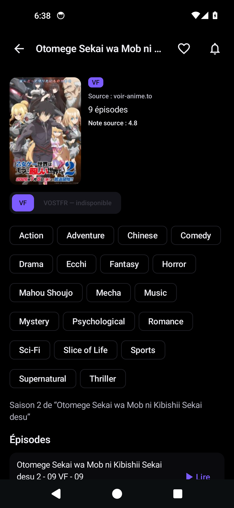

# Canta

An Android app that streams and downloads anime from **voir-anime.to** (VF and
VOSTFR), with a VOSTFR rescue catalogue on **nakanime.tv** when a mirror dies,
HLS playback through Media3 (no ffmpeg, no remux) and real offline downloads.

[](https://github.com/JCVERSA/canta/actions/workflows/ci.yml)
[](https://kotlinlang.org)
[](https://developer.android.com/media/media3)
[-blue)](https://developer.android.com/about/versions/marshmallow)
[](https://developer.android.com/compose)

## Table of contents

- [What it does](#what-it-does)
- [Screenshots](#screenshots)
- [Honesty rules the app follows](#honesty-rules-the-app-follows)
- [Tech stack](#tech-stack)
- [Architecture](#architecture)
  - [Mirror resolution](#mirror-resolution)
  - [Quality, sizes and the fast lane](#quality-sizes-and-the-fast-lane)
  - [Downloads and playback](#downloads-and-playback)
- [Reconnaissance](#reconnaissance)
- [Build and run](#build-and-run)
- [Tests](#tests)
- [Continuous integration](#continuous-integration)
- [Verification status](#verification-status)
- [Legal disclaimer](#legal-disclaimer)

## What it does

| | |
| --- | --- |
| Catalogue | Browse and search voir-anime.to (WordPress + Madara) as HTML — the `wp-json` REST API answers 403 behind Cloudflare |
| Series | Full episode list per season, VF and VOSTFR as separate entries, films/OAVs labelled as such instead of "Épisode 0" |
| Playback | ExoPlayer/Media3 plays the resolved HLS variant directly, with the stream's own `Referer`/`Origin` |
| Downloads | Media3 `DownloadManager` + `DownloadService` cache the same HLS variant for offline playback — no conversion step, no ffmpeg |
| Library | Favourites, watch history with resume position, watchlist |
| Watching for new episodes | A `WorkManager` job checks the watchlist for higher-numbered VF episodes and posts a notification |
| Theme | AMOLED pure black and a light theme, Material 3 |

## Screenshots

The images in [`screenshots/`](screenshots/) are captures of the running app,
taken by the `Device smoke test` workflow (API 34 x86_64 emulator, debug APK from
the same commit). Nothing there is a mock-up, and each file is named for what its
frames actually contain.

| Capture | What its frames contain |
| --- | --- |
|  | `01-app-amoled.png` — the catalogue with **real items scraped from `voir-anime.to`** on the CI emulator: pure-black AMOLED background, the search field, the VF/VOSTFR switch, `Source : voir-anime.to · page 1`, cover art, `Magilumiere Magical Girls Inc 2` with its `VF` badge, and the four-tab bar catching the next page (`Page suivante…`). Real posters on a 720×1568 emulator, not a mock-up |
|  | `02-notification-extras-launch.png` — the app launched with the episode watcher's extras for an id this install does not know, so it searched the title instead: `One` in the field, results headed `Recherche`, and items badged **VOSTFR**, which is the nakanime fallback working and being labelled honestly rather than passed off as VF |
|  | `04-detail-episodes.png` — the series detail screen reached by the smoke test's own walk: cover, `VOSTFR` badge, `Source : voir-anime.to`, the **`VF — indisponible`** label (the honest fallback, live), nineteen genre chips, the French synopsis, and the episode list below the fold |
|  | `03-settings.png` — the Settings screen: the VF/VOSTFR default and what it means, the 12-hour watcher note, and the Media3/offline explanation, with `Version Canta smoke-4aa21e6 (com.jcversa.canta)` from the build under test |

These come from the `Device smoke test` workflow's recent runs — one build, one
emulator session, evidenced by `screenshots/smoke-report.txt` from that same run:
`am start -W TotalTime 2831 ms`, `screen text: read`, three `capture verified:`
lines each recording that the app's own window was in front and that the dialog
state was the same before and after the screencap, `<none found in either buffer>`
for ANRs, `0` fatal exceptions, and `phase: done (0 problem(s) recorded)`.

The `Version Canta smoke-<sha>` line printed inside each frame is how to tell which
commit a picture belongs to — the file names are reused across runs.

`screenshots/smoke-report.txt` is the run's own record: emulator API/ABI, package
version, `am start -W` timing, the resumed activity, the visible text of each
screen, the per-capture verification lines and the ANR lines the platform logged.
Read it before trusting an image — and read the image before trusting the report's
file listing, which is only a directory listing.

**What is still not captured**: a playing stream, the quality selector with measured
sizes, a completed download and offline playback. The smoke test walks as far as a
series and taps `Lire` on the first episode; whether that reaches a playing frame
depends on the mirror ladder resolving a third-party CDN at that moment, and each
run's report says exactly how far it got. Anything not captured is listed in
*Verification status* below rather than implied by a screenshot.
[`screenshots/README.md`](screenshots/README.md) explains how to capture them.

## Honesty rules the app follows

These are enforced in code, not just in this file:

1. **A quality label comes from the playlist's `RESOLUTION=` attribute**, never
   from a file name, a page label or a bandwidth guess. The reconnaissance
   caught a player that advertised `720p HD` for a `1920x1080` stream; the app
   shows 1080P.
2. **A size is measured or absent.** Sizes come from per-segment `HEAD`/`Range`
   requests. When only a sample of the playlist could be probed, the UI marks
   the value « échantillon » and says it is extrapolated. No
   `bandwidth × duration` arithmetic is ever presented as a size.
3. **Language is structural.** On voir-anime a language is the slug of the entry
   (`-vf` / `-vostfr`). On nakanime the API's `language` field is treated as a
   hint only — the app reports the language of the URL that actually answered,
   and never auto-selects a VF track there.
4. **Failures are reported as failures.** If no mirror yields a playable
   stream, the app says which mirrors were tried and why the last one failed
   (`MirrorResolver.lastFailure`) instead of showing a spinner forever.
5. **Unsupported hosts are named as unsupported.** The reconnaissance found no
   playlist behind `mfw09.org` (a JavaScript SPA) or `streamtape.com`, so they
   are tried last and a failure on them is reported as a failure instead of
   being papered over — see `RECONNAISSANCE.md` §2.3.
6. **A downloaded episode is never silently deleted.** The download cache does
   not evict; when it is full the app refuses a new download and says how much
   space is used, instead of dropping an older episode.

## Tech stack

| Layer | Choice | Version |
| --- | --- | --- |
| Language | Kotlin — AGP's built-in Kotlin, no `org.jetbrains.kotlin.android` plugin | 2.4.10 |
| Compose compiler | `org.jetbrains.kotlin.plugin.compose` (its version tracks the Kotlin compiler) | 2.4.10 |
| Build | Gradle wrapper / Android Gradle Plugin | 9.7.1 / 9.4.0 |
| JDK | Java toolchain | 17 |
| SDK | `compileSdk` / `targetSdk` / `minSdk` | 37 / 36 / 23 |
| UI | Jetpack Compose + Material 3 | BOM 2026.08.00 |
| Playback | AndroidX Media3 (ExoPlayer, HLS, offline) | 1.11.1 |
| Scraping | Jsoup + OkHttp | 1.23.2 / 4.12.0 |
| Async | Kotlin Coroutines | 1.11.0 |
| Persistence | DataStore (Preferences) | 1.2.1 |
| Background | WorkManager | 2.11.2 |
| Tests | JUnit 4, kotlinx-coroutines-test, MockWebServer | 4.13.2 / 1.11.0 / 4.12.0 |

Dependency versions are the ones resolved in CI; the reconnaissance pass also
recorded the current stable release of each AndroidX library at the time of the
capture (`tools/recon/evidence/recon-summary.json`, `steps.versions`).

## Architecture

```
app/src/main/java/com/jcversa/canta/
├── App.kt                     Application, AppContainer, notification channels, work scheduling
├── MainActivity.kt            single activity, hand-rolled screen stack (no navigation library)
├── AppViewModel.kt            one ViewModel for catalogue, detail, player, library
├── model/                     Anime, Episode, MirrorResult/QualityTrack (+ JSON codecs)
├── scraper/
│   ├── ScraperUtils.kt        Http (OkHttp + block detection), Selectors, absSrc, VF/VOSTFR slugs
│   ├── VoirAnimeScraper.kt    catalogue, search, detail, episode list, mirrors, host switcher
│   └── NakanimeScraper.kt     XOR-decoded catalogue/search/seasons/sources APIs
├── extractor/
│   ├── VideoExtractor.kt      MirrorResolver (timeout, host priority, lastFailure) plus
│   │                          GenericExtractor: StreamScanner, the packed-JS unpacker
│   │                          and the VidMoly urlset/variant URL helpers
│   ├── VidmolyExtractor.kt    player setup → the variant playlist (VidMoly family)
│   ├── VoeExtractor.kt        Voe redirect chain (≤3 hops) + payload decode
│   └── QualityGuard.kt        master parsing, variant choice, measured sizes, fast lane
├── manager/
│   ├── DownloadManager.kt     Media3 offline: two caches, per-request headers, DownloadService
│   └── FavoritesManager.kt / HistoryManager.kt / WatchlistManager.kt   (DataStore stores)
├── ui/
│   ├── CatalogueScreen.kt, DetailScreen.kt, PlayerScreen.kt,
│   │   DownloadsScreen.kt, FavoritesScreen.kt, SettingsScreen.kt
│   ├── components/Components.kt   RemoteImage, badges, cards, loading/error/empty states
│   └── theme/Theme.kt             AMOLED black and light Material 3 colour schemes
└── worker/EpisodeWatcherWorker.kt
```

The layout mirrors the reference project **SwiftSlate-ng** on purpose: one
container in `App`, one ViewModel, managers behind it, no DI framework, no
navigation library (the app targets `minSdk 23`, and `navigation-compose`
requires 24).

### Mirror resolution

1. **voir-anime.to** — the episode page's own `thisChapterSources` table first
   (labels preserved), then the featured iframe, then any `embed-*.html` URL in
   the page source. When a page carries no player at all, the site's host
   switcher (`select.host-select option[data-redirect]`) is walked in DOM order,
   one extra fetch per host, stopping at the first page that yields a player.
2. **nakanime.tv** (VOSTFR rescue) — `POST /api/sources/anime`, decoded with the
   path-derived XOR key, only when the primary source produced nothing.
3. **Mirror priority**: VidMoly family → Voe → mfw09/streamtape/generic, with a
   14-second budget per mirror so a dead host cannot block the UI.

### Quality, sizes and the fast lane

* The master playlist is parsed for its variants; each variant is labelled from
  its own `RESOLUTION=`.
* Requested or automatic quality is resolved to a variant; the size is measured
  through `HEAD`/`Range` requests on the segments (every segment when the
  playlist is small, a scaled sample when it has hundreds).
* Fast lane: if a **measured** 480P/360P stream exceeds 200 MiB and a lighter
  variant ≤ 480p exists, the app downgrades and prints the decision with both
  numbers (`QualityGuard`, from the reference audit §8.13). The rule applies to
  the automatic choice as well as to an explicit request — the automatic choice
  is what a user with no preference actually gets — and only a measured size can
  trigger it: an unknown size is treated neither as small nor as large. 720P and
  1080P are never downgraded on this rule.

### Downloads and playback

Two caches, because Media3 requires the download cache to be non-evicting:

| Cache | Directory | Evictor | Purpose |
| --- | --- | --- | --- |
| Offline | `filesDir/canta_offline` | `NoOpCacheEvictor` | downloaded episodes; the 4 GiB ceiling is enforced by **refusing** a new download |
| Stream | `cacheDir/canta_stream` | `LeastRecentlyUsedCacheEvictor` (512 MiB) | ordinary streaming buffer |

A download request stores its own metadata (episode, language, quality, measured
size, exactness, host) **and its `Referer`/`Origin`**, because the CDN ladder
needs them and a download can outlive the process that started it. The download
service builds one downloader per request from that stored data
(`HlsDownloader` for playlists, `ProgressiveDownloader` for MP4), so what is
downloaded is exactly the variant the player resolved.

Playing a finished download reuses the stored stream URL and the offline cache:
no mirror is re-resolved, which is what makes playback work with the network
off. The player says « Lecture hors ligne » rather than pretending it just
scraped something.

## Reconnaissance

Phase 0 of this project was a live reconnaissance of all four layers (catalogue,
episode page, embed players, secondary catalogue). It is written up in
**[`RECONNAISSANCE.md`](RECONNAISSANCE.md)**, with the raw captures versioned in
[`tools/recon/evidence/`](tools/recon/evidence/) and the capture script in
[`tools/recon/recon.mjs`](tools/recon/recon.mjs). Re-run it with the
`Recon (Phase 0)` workflow.

## Build and run

Requirements: **JDK 17** and the Android SDK (or an Android Studio install that
provides one). No `local.properties` is required — the wrapper resolves the
plugins from `google()`/`mavenCentral()` and the build works with nothing but a
JDK, which is what makes it usable from restricted environments.

```bash
git clone https://github.com/JCVERSA/canta.git
cd canta

# Debug build (debug-signed, installable)
./gradlew :app:assembleDebug
adb install -r app/build/outputs/apk/debug/*.apk

# Preview build: same code, different applicationId (com.jcversa.canta.preview),
# debug-signed, minified — installing it never touches a stable install
./gradlew :app:assemblePreview
adb install -r app/build/outputs/apk/preview/*.apk

# Unit tests
./gradlew :app:testDebugUnitTest
```

Versioning is injected, so a CI build can label itself without editing files:

```bash
./gradlew :app:assembleDebug -PversionCode=42 -PversionName=1.0.42
```

The `release` variant is minified and **unsigned by design** — a release keystore
is the publisher's business, not the repository's. Installable builds come from
`assembleDebug` and `assemblePreview`.

Every workflow run attaches the built APKs as downloadable artifacts, and the
bots also commit each job's plain-text log into `.ci-logs/` on the branch, so a
failing build can be read without leaving GitHub. Artifact uploads are
non-fatal: a storage-service error is infrastructure, not a code problem.

A committed log is written **only when that job failed**, and each file carries
its own `sha:` and `date:` header. So a log whose `sha` is not the commit you are
looking at is history, not status — read the header before believing the errors
inside it, because a stale `unit-tests.txt` still reads like a live failure.

## Tests

```bash
./gradlew :app:testDebugUnitTest
```

Unit tests run on the plain JVM and need no device or emulator:

* `VoirAnimeScraperTest` — parsing against markup captured live during the
  reconnaissance: the four-mirror `thisChapterSources` table, home and search
  cards (different containers, different thumbnails), newest-first ordering of a
  1110/1109/Film episode list, host-switcher URLs with spaces, and a page whose
  default player is dead.
* `QualityGuardTest` — master-playlist parsing with labels derived from
  `RESOLUTION=` (including ignoring `I-FRAME-STREAM-INF`), `EXTINF` durations,
  the fast-lane downgrade policy at 200 MiB, and the guarantee that 720P/1080P
  and unmeasured tracks are never downgraded.

## Continuous integration

| Workflow | Trigger | What it does |
| --- | --- | --- |
| [`ci.yml`](.github/workflows/ci.yml) | every push and pull request | builds the debug APK, the preview APK and runs the unit tests, each in its own job |
| [`recon.yml`](.github/workflows/recon.yml) | manual dispatch | re-runs the live reconnaissance and commits the gzipped evidence |

Both workflows publish the raw Gradle output (and a pre-filtered
`*-errors.txt`) into [`.ci-logs/`](.ci-logs/) so a failure can be diagnosed
without downloading anything.

## Verification status

Stated plainly, because it is easy to over-claim:

* **Verified in CI**: the app compiles (`compileDebugKotlin`,
  `compilePreviewKotlin`), the release-variant R8 pass and `lintVital` pass, both
  APKs assemble, and the unit tests pass.
* **Verified against live captures**: every selector and endpoint in
  `RECONNAISSANCE.md`, including the two master playlists with their measured
  variant tables and the six-combination referer matrix.
* **Verified on an emulator (CI, API 34 x86_64)**: the app launches cold in
  2.8 s and reaches its first frame; the catalogue loads **real series from
  `voir-anime.to`**; a search returns results, including the **VOSTFR** nakanime
  fallback labelled as such; the Settings tab renders; a launch carrying the
  episode watcher's extras for an unknown id resolves to a title search instead of
  opening nothing; no ANR is logged against the app and the crash buffer is empty.
  Three captures in `screenshots/` are from that run, and the report next to them
  is its own record.
* **Not yet verified on a device**: end-to-end playback (ExoPlayer reaching a
  playing state on a resolved HLS stream), the download queue with its
  notifications, offline playback, and the periodic episode watcher's actual
  notification. These need a scripted walk into a series and an episode — the
  harness does not do that yet, and they are listed here rather than implied by a
  screenshot.

## Legal disclaimer

Canta is an **independent client**. It is not affiliated with, endorsed by, or
connected to voir-anime.to, nakanime.tv, VidMoly, Voe, mfw09, streamtape or any
other host it reads; those sites are third parties whose pages are scraped at
runtime, and they can change their markup at any time.

* The app **hosts no content**. It does not embed, mirror or redistribute any
  video: it resolves a URL published by the sites themselves and hands it to a
  standard media player.
* Scraping and downloading may violate a site's terms of service and/or
  local copyright law. **You are responsible for how you use this software** and
  for complying with the law where you live, including the rights of the
  copyright holders of any work you access.
* Please respect the sources: the app is deliberately low-rate (one page fetch
  per episode, at most one extra fetch per host when failing over, and a
  twice-daily watchlist check), and `Downloads` is scoped to the 4 GiB offline
  cache. Do not modify it to hammer the sources.
* No warranty. The software is provided as is; the authors are not liable for
  any use of it.
