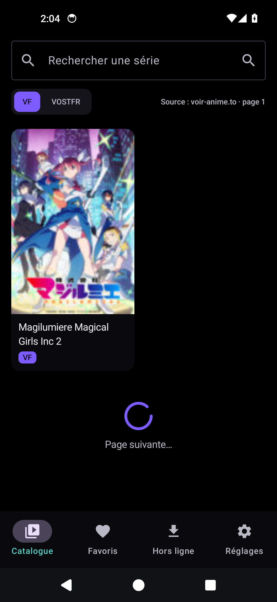
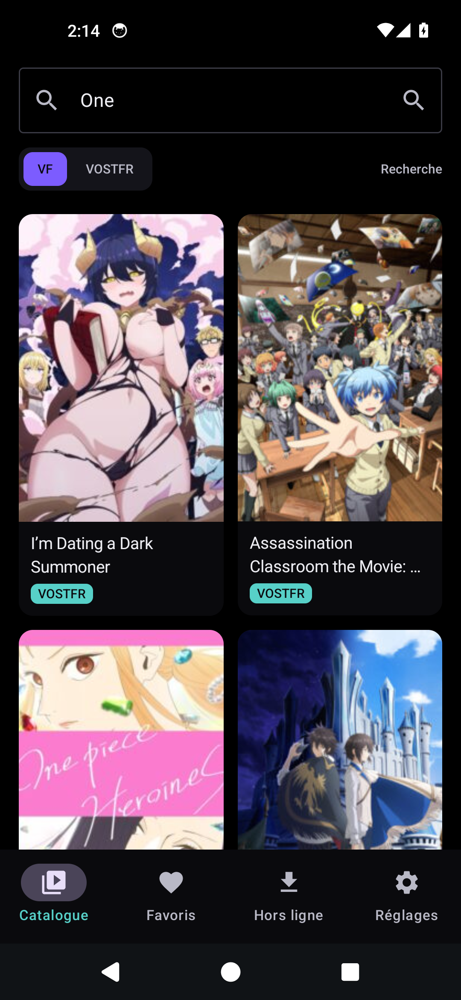
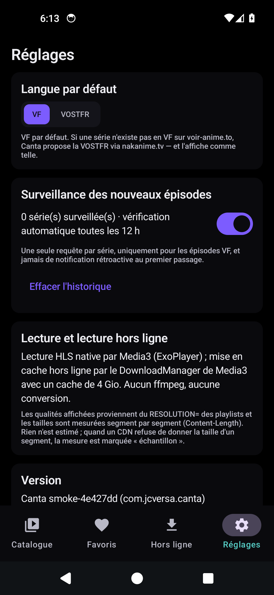

# Screenshots

Images in this directory are captures of the **running app**, taken from the
`Device smoke test` workflow (API 34 x86_64 emulator, debug APK built from the
same commit). Nothing here is a mock-up: this project does not publish a picture
of a screen it cannot render.

## What is currently here

| File | Shows | Notes |
| --- | --- | --- |
|  `01-app-amoled.png` | The catalogue, loaded from the live source | Run 16. Real items scraped from `voir-anime.to` — covers, titles, `VF` badges, `Source : voir-anime.to · page 2`. The earlier capture under this name showed the loading spinner because the emulator it ran on was broken (no KVM, then a harness bug); that was never a network limit, and this run proved it. |
|  `02-notification-extras-launch.png` | A VOSTFR search fallback | Run 16. Launched with the episode watcher's extras for an unknown id: the app searched the title (`One`) instead of opening nothing, and the results are badged `VOSTFR` because they come from the nakanime fallback and are labelled honestly. |
|  `03-settings.png` | Settings, AMOLED theme | Captured by the smoke test after it verified the tab was reached (by text unique to that screen) and that the app's own window was on screen. The version string in the frame names the build it came from. |
| `smoke-report.txt` | The run's own record | Emulator API/ABI, package version, `am start -W` timing, resumed activity, per-screen visible text, per-capture verification lines, ANR lines. |

The three captures above are the only ones this project currently vouches for, and
the directory is thin on purpose: earlier runs produced files under these names
whose frames were the **launcher** (the system ANR dialog had been dismissed with
BACK, which also left the app) and then the app behind the emulator's own "not
responding" dialog. Those were mislabelled claims, so they were deleted rather
than renamed or annotated - a picture whose label cannot be checked is worse than
no picture.

The script enforces that rule mechanically. A capture is written only when the
app's own window is on screen, checked by three independent probes (focused
window, accessibility dump, window manager) with the one that answered recorded
in the report; and a run that cannot produce one verified capture fails.

Deciding the file name took three attempts, which is worth recording because each
failure was a claim the image could not support:

1. the state was sampled *after* the screencap, so run 8's report said "system
   dialog in front: yes" next to a clean frame (the dialog arrived in between);
2. the state was then sampled *before* it, so run 9 shipped a clean Settings frame
   named `03-settings-with-system-dialog.png` (the dialog vanished in between);
3. now the state is sampled on both sides of the screencap and the capture is
   retaken when the two answers disagree. A state that will not settle is named
   `-dialog-state-changed-mid-capture.png`, because which of the two moments the
   frame shows is not knowable from the outside - guessing would be the same
   mistake in a new costume.

The name therefore always means one of three checkable things: the plain name (no
dialog, stable), `-with-system-dialog` (dialog up, stable), or
`-dialog-state-changed-mid-capture` (unsettled, and it says so).

Not captured, and deliberately not implied: playback, the quality selector with
measured sizes, a download in progress, and offline playback. None of these is a
network limit — run 16 reached both sources from the CI runner; they need the smoke
test to walk into a series and an episode, which it does not do yet. Capture them on a
real connection (procedure below) and update *Verification status* in the root
README in the same change.

## How they are produced

1. Get an installable build — either from a CI run (the `debug-apk` artifact of
   the `CI` workflow) or by building locally:

   ```bash
   ./gradlew :app:assembleDebug
   adb install -r app/build/outputs/apk/debug/app-debug.apk
   ```

2. Capture the screens worth showing, with the app in the theme you want to
   document (`AMOLED` and light are both in Settings):

   ```bash
   # AMOLED / dark
   adb shell "cmd uimode night yes"
   adb exec-out screencap -p > screenshots/01-app-amoled.png

   # light
   adb shell "cmd uimode night no"
   adb exec-out screencap -p > screenshots/04-catalogue-light.png
   ```

3. The remaining shots, for a machine that can reach the sources:

   | File | Screen | What it has to show |
   | --- | --- | --- |
   | `04-catalogue-light.png` | Catalogue (light) | the same screen in the light theme |
   | `05-detail-episodes.png` | Series detail | episode list newest-first, film/OAV labels |
   | `06-player-quality.png` | Player | measured size, host, quality chips, downgrade note if it fired |
   | `07-downloads.png` | Downloads | progress, pause/resume, size on disk |
   | `08-offline-playback.png` | Player, airplane mode | « Lecture hors ligne » on a finished download |

   Name a file for the state it really shows: if the catalogue is reporting an
   unreachable source when you capture it, that is worth keeping — but not under a
   name that implies a grid of covers.

   For `08-offline-playback.png`, enable airplane mode after the download
   finishes: the point of the screenshot is that playback works with no network
   and the app says why.

4. Keep the PNGs under ~500 KB each (`pngquant`, `optipng` or Android Studio's
   exporter) and reference them from the root `README.md`.

If a screen cannot be captured because it does not work yet, it is listed in the
root README's *Verification status* section instead of being illustrated with
something invented.
